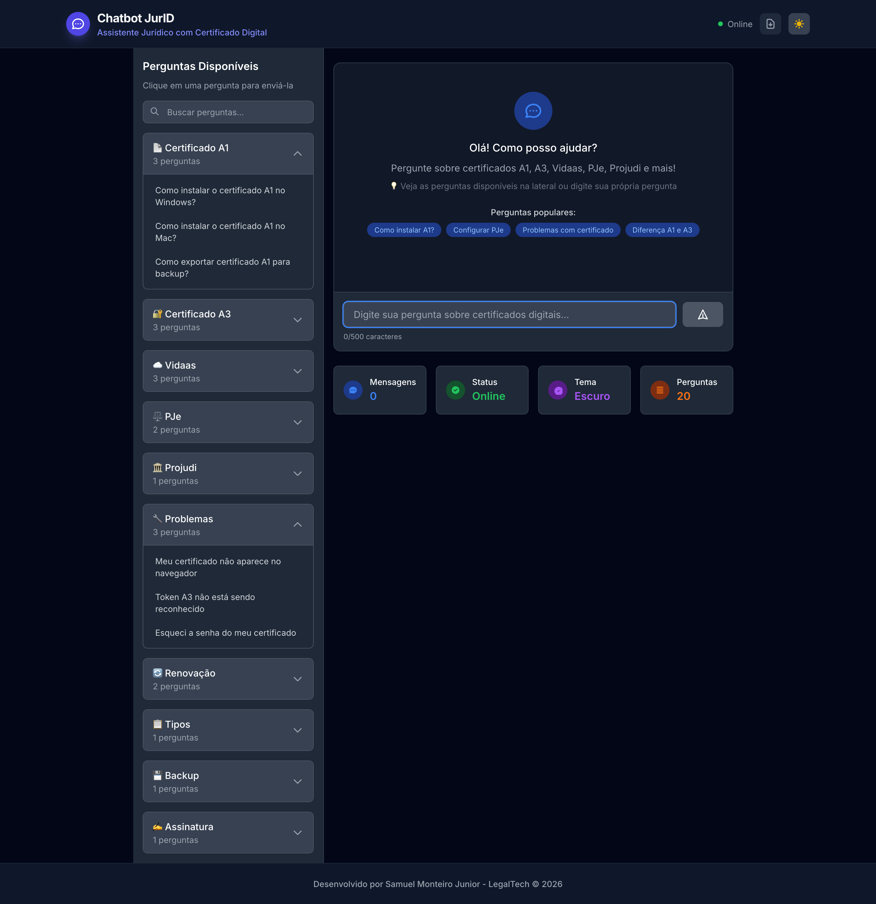

# Chatbot JurID ⚖️🤖

**Assistente virtual jurídico especializado em Certificados Digitais (A1, A3, Nuvem)**

Chatbot full-stack para triagem e suporte técnico de advogados brasileiros na emissão e instalação de e-CPF, e-CNPJ e certificados Vidaas.

## 🎨 Interface Premium SaaS 2026
- Tema indigo/blue dark/light mode automático  
- Animações suaves com Vue `<TransitionGroup>`  
- Histórico de conversas (salvo no navegador)  
- Exportar conversa como PDF ou TXT  
- Botão “Copiar resposta” com 1 clique  
- Loading animado + bolhas modernas

## 📸 Screenshots
<div align="center">
  
</div>

## Tecnologias
- **Frontend**: Vue 3 + Vite + Tailwind CSS (dark/light mode)  
- **Backend**: Node.js + Express + Helmet + Rate Limiting  
- **IA**: knowledgeBase.json com matching de palavras-chave  
- **DevOps**: Docker + docker-compose + PM2 + Vercel-ready

## Funcionalidades
- Respostas instantâneas sobre instalação A1/A3  
- Fluxo guiado de troubleshooting  
- Suporte a múltiplos certificados  
- Histórico de conversas  
- Totalmente offline-ready

## Integrações LegalTech
Arquitetura 100% preparada para integrar com **Lexter.ai**, **Cria.AI** e sistemas de assinatura digital. Pronto pra virar produto SaaS.

## Como rodar
```bash
git clone https://github.com/samuelmonteirotf/chatbot-jurid.git
cd chatbot-jurid
docker-compose up --build